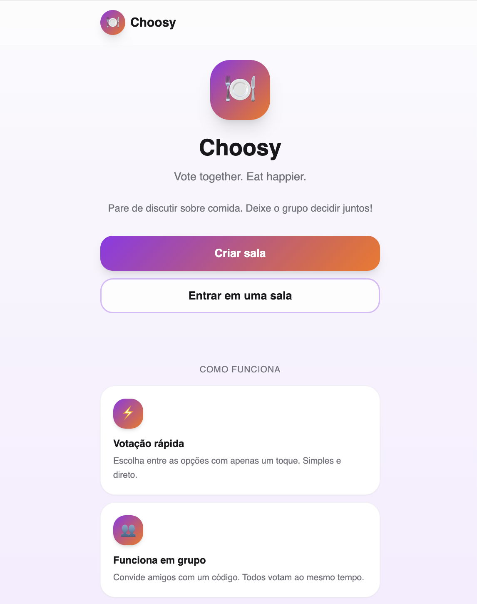
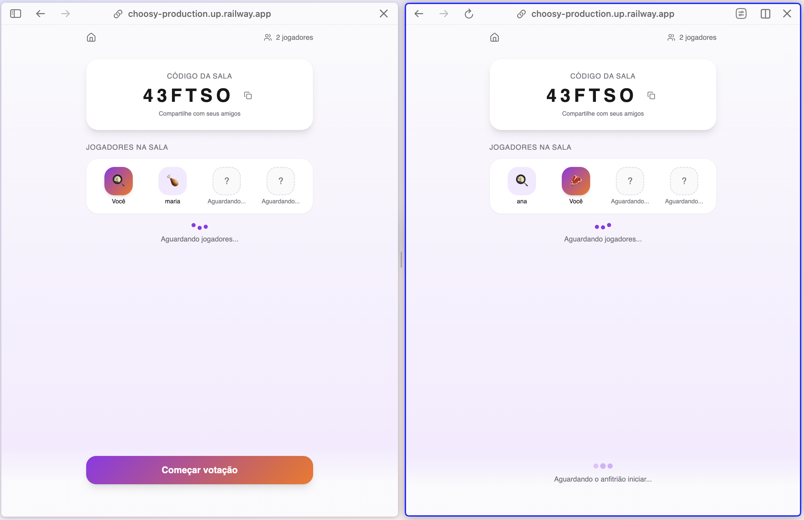
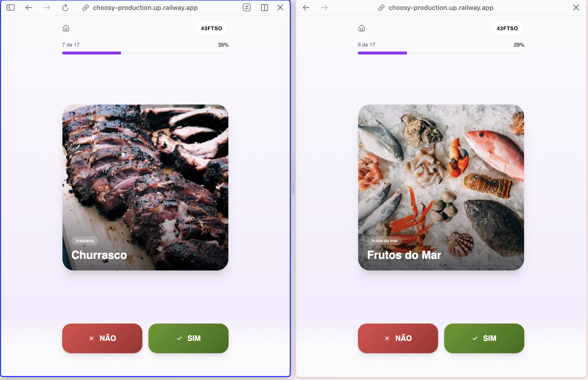
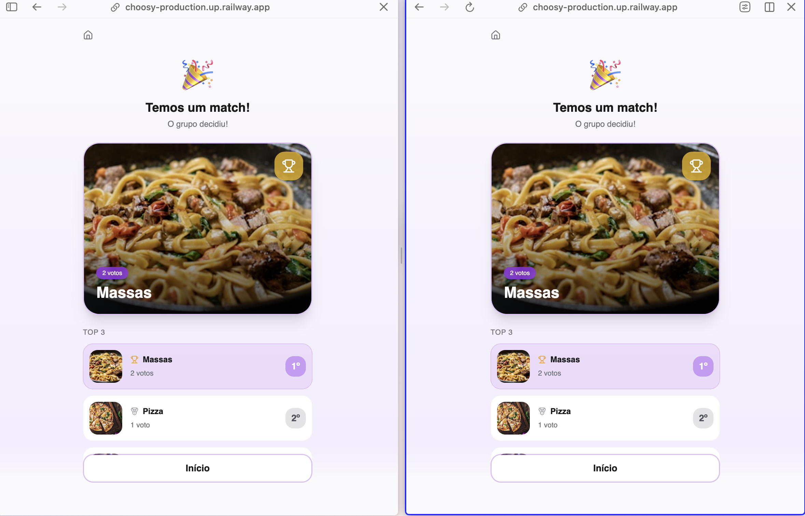

# 🍽️ Choosy — Decide Food Together

<div align="center">


</div>

## 🍕 What is Choosy?

**Choosy** is a real-time multiplayer food voting app made for one very specific problem:
>“What are we going to eat?”

Instead of spending 40 minutes arguing in the group chat, users create a room, invite friends, and vote on food options Tinder-style until the app finds the best match for the group.

Fast, fun, chaotic, and actually useful.


## ✨ Features

### 🏠 Multiplayer Rooms

- Create private rooms with unique codes
- Join rooms with friends instantly
- Live waiting room with connected players
- Share room codes easily

### 🍣 Real-Time Voting

- Swipe-style food voting
- Like or dislike food options
- Multiplayer synchronized experience
- Voting progress tracking

### 🎯 Smart Match System

- Calculates the most voted foods
- Finds group matches automatically
- Percentage-based consensus system
- Displays top food options when no perfect match exists

### 👥 Live Player Updates

- Real-time room refresh
- Player join tracking
- Waiting room animations
- Dynamic player list

### 📱 Mobile-First Experience

- Responsive UI
- Smooth animations with Framer Motion
- Modern glassmorphism-inspired interface
- Optimized for mobile usage


## 📸 Screenshots

### Home



### Waiting Room



### Voting



### Results




## 🛠️ Tech Stack

### Frontend

- React 19 – UI library
- TypeScript – Type safety
- Vite – Frontend tooling
- Tailwind CSS – Styling
- Framer Motion – Animations
- React Router – Routing
- Axios – API communication
- Lucide React – Icons

### Backend

- Ruby on Rails API – REST backend
- PostgreSQL – Database
- Active Record – ORM
- RESTful architecture

### Architecture

```
/frontend  → React + Vite app
/backend   → Rails API
```

-	RESTful API structure (/api/v1)
- Polling-based real-time updates
- Monorepo organization

```
Frontend (React)
       ↓
REST API (Rails)
       ↓
Database (PostgreSQL)
```


### Real-Time Strategy

The application currently uses polling to keep rooms synchronized.

Clients periodically request room status updates, allowing players to see joins, voting progress, and results without requiring page refreshes.

Future versions may migrate to WebSockets using ActionCable.


## Technical Challenges

During development, some interesting problems included:

- Synchronizing multiplayer room state
- Preventing duplicate votes
- Calculating group consensus fairly
- Managing polling without excessive API requests
- Handling room lifecycle and player sessions


## 🚀 Getting Started

### Prerequisites

-	Node.js 18+
-	Ruby 3+
-	PostgreSQL

### Installation

1. Clone the repository

```bash
git clone https://github.com/devanaclimgo/choosy.git
cd choosy
```

2. Backend setup

```bash
cd backend

bundle install

rails db:create 
rails db:migrate
rails db:seed

rails server
```

Backend runs on:

```bash
http://localhost:3000
```

3. Frontend setup

```bash
cd frontend

npm install

npm run dev
```

Frontend runs on

```bash
http://localhost:5173
```


## Project Structure

```bash
choosy/
├── backend/
│   ├── app/
│   │   ├── controllers/api/v1/
│   │   │   ├── rooms_controller.rb
│   │   │   ├── votes_controller.rb
│   │   │   └── food_options_controller.rb
│   │   │
│   │   ├── models/
│   │   │   ├── room.rb
│   │   │   ├── player.rb
│   │   │   ├── vote.rb
│   │   │   └── food_option.rb
│   │   │
│   │   └── services/
│   │       └── result_calculator_service.rb
│   │
│   └── config/
│
├── frontend/
│   ├── src/
│   │   ├── components/
│   │   ├── pages/
│   │   ├── services/
│   │   ├── lib/
│   │   └── ui/
│
└── README.md
```


## 🔄 How It Works

**1. Create a room**

A user creates a room and receives a unique room code.

**2. Friends join**

Players join using the shared room code.

**3. Voting starts**

The host starts the voting session.

**4. Everyone votes**

Players like/dislike food options individually.

**5. Match calculation**

The backend calculates:

- Most liked foods
- Match percentage
- Top 3 alternatives if consensus is low


## 🧠 Match Logic

Choosy uses a percentage-based voting system.

If a food reaches at least:

*If 70% or more of players like the same food, the app declares it as the group match.*

then the app declares it as the group match.

Otherwise, the system returns the top 3 most voted foods.

## 🌐 API Endpoints

### Rooms

```bash
POST   /api/v1/rooms
GET    /api/v1/rooms/:code
POST   /api/v1/rooms/:code/join
POST   /api/v1/rooms/:code/start
GET    /api/v1/rooms/:code/results
```

### Votes

```bash
POST /api/v1/votes
```

### Food options

```bash
GET /api/v1/food_options
```

## Environment Variables

Frontend

```env
VITE_API_URL=http://localhost:3000/api/v1
```

Backend

```env
FRONTEND_URL=http://localhost:5173
DATABASE_URL=...
```


## 💡 Future Improvements
- 🔥 WebSockets with ActionCable
- 👥 Real-time live updates without polling
- 🍔 Restaurant API integration
- 📍 Location-based food suggestions
- 🎵 Spotify party mode vibes
- 📲 PWA support
- 🧠 AI-powered food recommendations
- 🎲 Random “surprise me” mode

## 🎨 UI Inspiration

Choosy was designed to feel:

- playful
- modern
- social
- fast
- mobile-native

Inspired by:

- Tinder swipe interactions
- Party games
- Food delivery apps
- Gen Z social interfaces

## 🔗 Live Demo

Frontend:
https://choosy-production.up.railway.app/

Backend API:
https://choosy-back-production.up.railway.app/


## 👩‍💻 Creator

**Ana Clara** - Creator of Choosy

  - 📧 **Email**: anaclimgo@gmail.com
  - 🔗 **GitHub**: [@devanaclimgo](https://github.com/devanaclimgo)
  - 💼 **LinkedIn**: [Ana Gomes](https://www.linkedin.com/in/ana-gomes-dev)


---

<div align="center">

###### Made with 🍕 and chaos by Ana Gomes

</div>